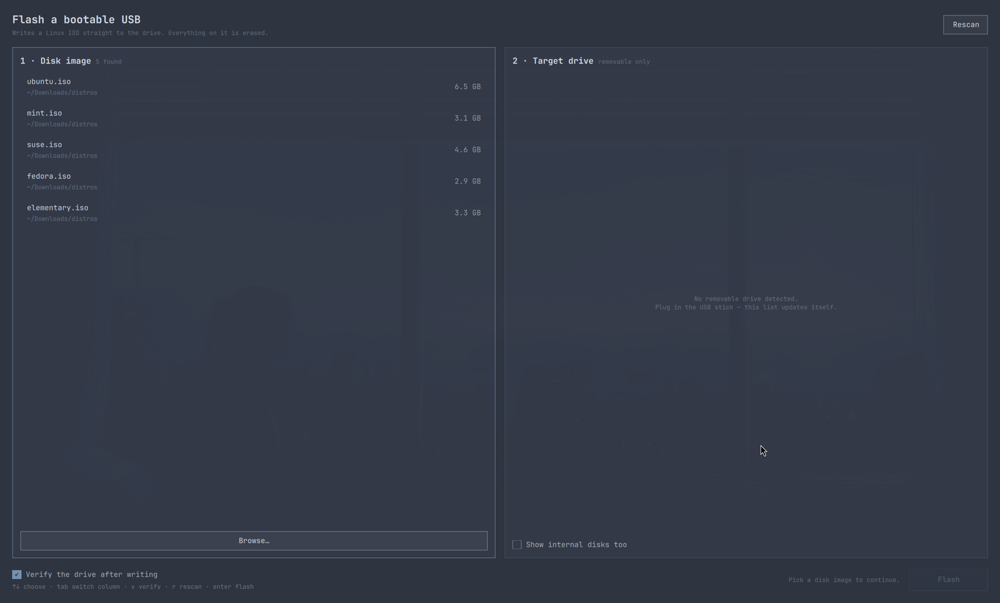
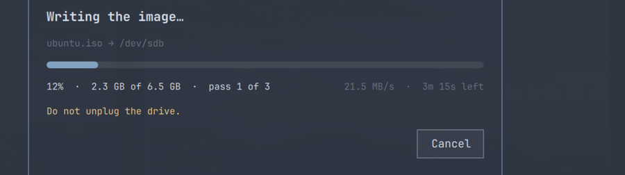

# omarchy-usb-flasher

A small [Quickshell](https://quickshell.org/) app for [Omarchy](https://omarchy.org/)
that writes a Linux ISO to a USB drive.

Pick an image, pick a drive, confirm once, watch the progress bar. It picks up
the colors, font, and corner radius of whatever Omarchy theme is active, so it
looks like the rest of the desktop rather than a transplanted GTK dialog.





## Why

`dd if=… of=/dev/sdX` is the right tool and also the one that eats the wrong
disk when you mistype a letter at 1am. This is that command with the parts that
matter made visible:

- **Only removable drives are offered.** Internal disks are hidden behind an
  explicit toggle, and any disk carrying `/`, `/boot`, `/home`, `/var` or swap
  cannot be selected at all.
- **One confirmation, with the details spelled out** — the drive's model, its
  size, its mount points, and the fact that all of it is about to be gone.
- **Verification after the write**, on by default: the drive is read back and
  its SHA-256 compared against the image. A silently bad stick is worse than a
  failed write.
- **One password prompt.** Unmount, wipe, write, flush and verify all happen in
  a single privileged helper rather than five separate `pkexec` calls.

## Requirements

- Quickshell 0.3+
- `polkit` with an agent running (Omarchy's shell provides one)
- `util-linux` (`lsblk`, `wipefs`, `blockdev`), `coreutils`, `bash`

All of these are already on a stock Omarchy install.

Tested on Omarchy 4.0.0.alpha with Quickshell 0.3.1, writing a Linux Mint ISO
to a USB stick that then installed cleanly.

## Install

### As an Omarchy plugin (recommended)

```bash
omarchy plugin add https://github.com/ianleon/omarchy-usb-flasher.git --enable --yes
```

It loads into the running `omarchy-shell` as an overlay. Summon it with:

```bash
omarchy-shell shell toggle io.github.ianleon.usb-flasher '{}'
```

Bind that to a key in `~/.config/hypr/hyprland.conf` if you use it often:

```
bind = SUPER SHIFT, U, exec, omarchy-shell shell toggle io.github.ianleon.usb-flasher '{}'
```

**Removal:**

```bash
omarchy plugin remove io.github.ianleon.usb-flasher --yes
```

That deletes `~/.config/omarchy/plugins/io.github.ianleon.usb-flasher/` and drops
the entry from `~/.config/omarchy/shell.json`. Nothing else on the system is
touched — the plugin writes no configuration of its own.

### As a standalone app

Useful on a plain Quickshell setup, or for hacking on it:

```bash
git clone https://github.com/ianleon/omarchy-usb-flasher.git
cd omarchy-usb-flasher
./install.sh
```

`install.sh` symlinks the checkout into place — it does not copy — so editing
the repo edits the installed app:

| Link | Target |
|------|--------|
| `~/.config/quickshell/omarchy-usb-flasher` | the repo |
| `~/.local/bin/omarchy-usb-flasher` | `bin/omarchy-usb-flasher` |
| `~/.local/share/applications/omarchy-usb-flasher.desktop` | `share/…desktop` |

Then launch it from the app launcher, or:

```bash
omarchy-usb-flasher
```

`./uninstall.sh` removes the three symlinks and nothing else.

### Floating window (standalone only)

As a standalone app it is a normal window, so Hyprland tiles it by default. To float it at a
comfortable size, add to `~/.config/hypr/hyprland.conf`:

```
windowrule = float, class:org.quickshell, title:^(USB Flasher)$
windowrule = size 1000 720, class:org.quickshell, title:^(USB Flasher)$
windowrule = center, class:org.quickshell, title:^(USB Flasher)$
```

## Using it

Disk images are found automatically in `~/Downloads`, `~/Desktop`,
`~/Documents`, `~/ISOs`, `~/isos` and `~/Images` (two levels deep), newest
first. Anything elsewhere goes in through **Browse…**.

The drive list refreshes itself every two seconds, so plugging the stick in
after opening the app is fine.

Everything works from the keyboard:

| Key | Action |
|-----|--------|
| `↑` `↓` / `j` `k` | move within the focused column |
| `Tab` / `←` `→` | switch column |
| `v` | toggle verification |
| `r` | rescan images and drives |
| `Enter` | flash (then again to confirm) |
| `Esc` | back out, or quit |

## What it actually runs

`flash.sh`, once, as root through `pkexec`:

1. unmounts every partition of the target and disables swap on it
2. refuses to continue if the drive is smaller than the image
3. `wipefs -a` to clear stale partition signatures
4. `dd bs=4M oflag=direct conv=fsync` to write the image
5. `sync` + `blockdev --flushbufs`
6. optionally SHA-256s the image and the first *n* bytes of the drive and
   compares them

The script's stdout is a line protocol (`TOTAL`, `STAGE`, `VERIFY_OK`,
`ERROR`, `DONE`, plus `dd`'s own progress) that the UI parses for the progress
bar, throughput and ETA. Nothing else in the app needs privileges.

**Cancelling** during the write signals the root process and stops `dd`. The
drive is then half-written and not bootable — expected, but worth saying out
loud.

## Limitations

- Writes images byte-for-byte. That covers every modern Linux ISO (they are
  hybrid/isohybrid images), but it is not Ventoy and it does not create a
  persistence partition.
- One drive at a time.
- No checksum-against-the-vendor's-published-hash step yet; verification only
  proves the drive matches the file you gave it.

## Development

See [CONTRIBUTING.md](CONTRIBUTING.md) — in particular `USB_FLASHER_DRY_RUN`,
which rehearses the whole flow against a plain file, unprivileged, so you never
need a spare USB stick to work on the app.

## License

MIT — see [LICENSE](LICENSE).
